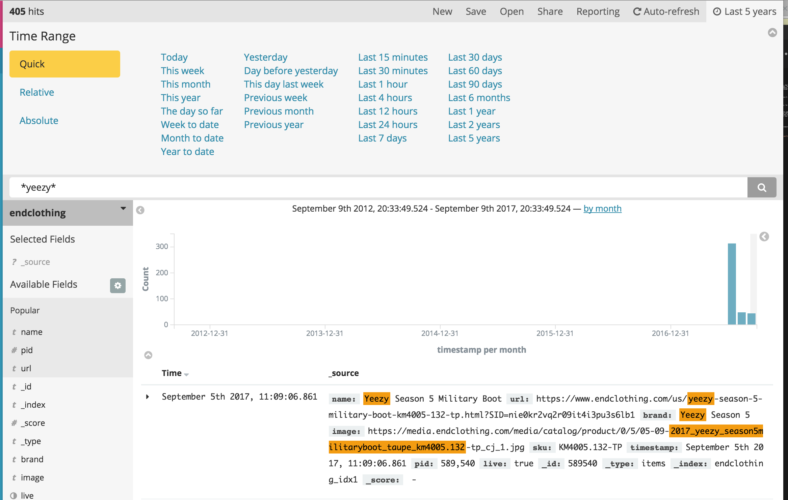
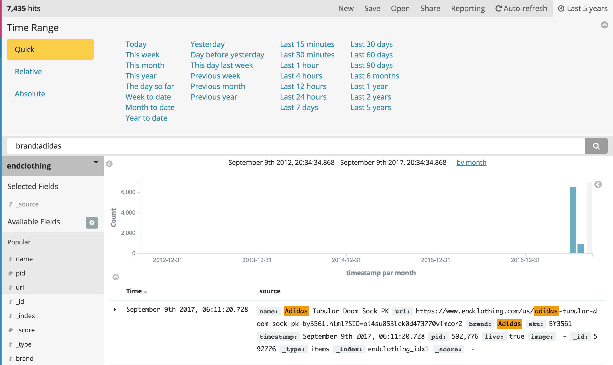
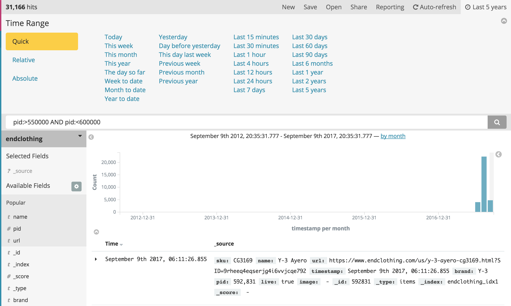

# PidPid

## Searching for products and advanced queries

There are **two** types of scrapers in PidPid. 

### Metadata scrapers
Metadata scrapers discover the product name, product id, link, and sometimes the product image.

### Image scrapers
> Barneys, Size, JDSports, FootPatrol, MrPorter, and NetAPorter. 

Products scraped by an image scraper do not have a name tag associated *at first*. For **image** scrapers, you'll need to manually check the images scraped in the respective indexes in order to discover early links or product ids. This is a limitation of the website being scraped rather than a limitation in PidPid's scraping methods. However, for live products, the metadata is attached and searchable. This tutorial will focus on searching in metadata-oriented indices. Every index except the ones mentioned above are metadata oriented.

## Searching for a product
* Open the index/site from the Dashboard.
* Select an appropriate timeframe.
* Search for a product by brand, pid, or name. To search for any product containing the word *yeezy* in any of its fields, enter the following in the search bar:
```
*yeezy*
```

* The asteriks are formally called *globs*. Globs will match any characters before or after the word yeezy. For example, a product with the title *Yeezy Boost 350 V2 Beluga* or *Kanye West Yeezy* will match this search.

<a href="./images/searchglob.png" class="thumbnail">

</a>


## Advanced searching
* Every product listed has a number of fields, such as `name`, `pid`, `brand`, etc. Not every index has the same fields, however all indexes contain at least the `name`, `pid`, and `timestamp` fields. The variation of fields depends on the data scraped.
* You can search a specific field or across multiple fields. If we only want to search for products that have the brandname *Adidas* on Antonini, enter one of the the following into the search bar, depending on how strict you want your search to be.
```
brand:adidas
```
```
brand:*adidas*
```

<a href="./images/searchbrand.png" class="thumbnail">

</a>

* To search a range of pids, enter the following into the search bar. The following search displays all products with a pid greater than 550000 and less than 600000.
```
pid:>550000 AND pid:<600000
```

<a href="./images/searchbrand.png" class="thumbnail">

</a>

## More information
* For more information on Kibana/Elasticsearch queries, read the following: [Kibana User Guide | Queries and Filters](https://www.elastic.co/guide/en/kibana/3.0/queries.html)