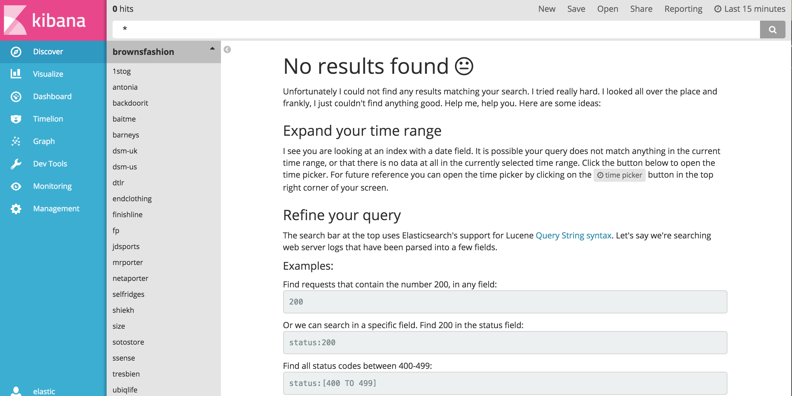
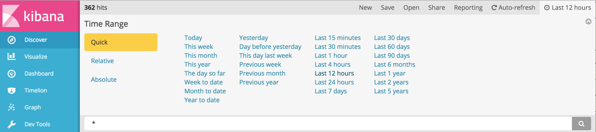
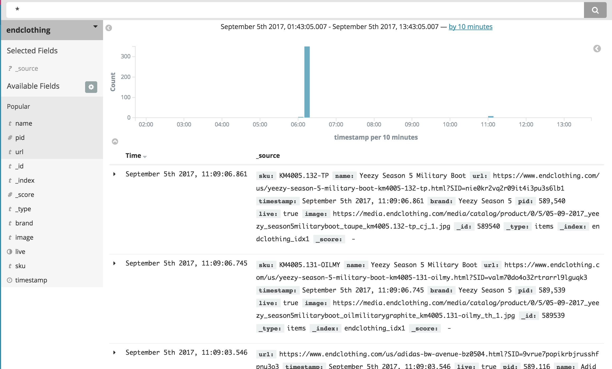

# PidPid

## Viewing recent products
* Login to [http://pidpid.snkattck.co](PidPid)

## Selecting an index
* Click **Discover** on the leftmost menu.
* Click the other dropdown menu, which defaults to the **Brownsfashion** index, to reveal all the sites currently scraped by PidPid. Select a site to view. In this example, I'm using **Endclothing**.

## Viewing most recently discovered products
* Seeing **No results found**? The default time range is fifteen minutes -- you'll only see products discovered in the last fifteen minutes. This is mostly useful for sites that have very frequent updates like **Brownsfashions**. 
* Select a more reasonable timeframe: Select the clock icon in the upper right hand corner and click **Last 12 hours**

* You will be presented with the last 12 hours of data, including fields representing the *pid*, *name*, *url*, and product *brand*. Scroll up and down to browse these results. Play around with the timeframe. Some sites update as rarely as twice per week, some update daily or hourly. 

* The above steps apply to all indices on PidPid.

